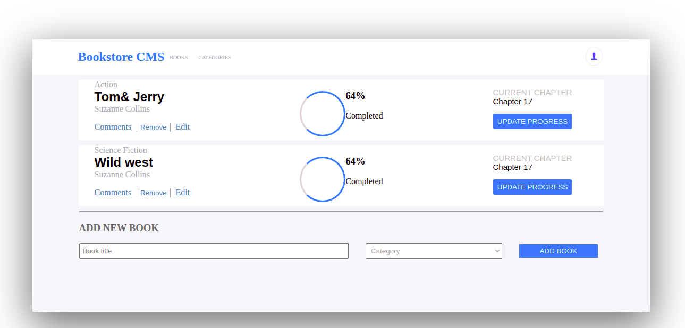

# BOOKSTORE

> In this Book Store project:
- Display all the books.
- Add the book.
- Select the category.
- Delete the book/books.

This project was bootstrapped with Create React App.

## Built With

- HTML& CSS
- REACT & REDUX
- Node.js

## Live Demo

[Live Demo Link](https://angry-bassi-da3bfc.netlify.app/)

## Getting Started

- To clone this project Run command: $git clone
- used the link git@github.com:aakbarkhan/bookstore.git reposiratory.
- OR press the green Code button in the upper right corner and choose to download from the Download ZIP link.
### Setup

- Use Create React App (CRA).
### Install
- npx create-react-app bookstore
- cd bookstore
- npm start
- React Redux
- npm install react-redux
## Authors

# Aku

👤 **Author1**

- GitHub: [@aakbarkhan](https://github.com/aakbarkhan)
- Twitter: [@twitterhandle](https://twitter.com/twitterhandle)
- LinkedIn: [LinkedIn](https://linkedin.com/in/linkedinhandle)

## 🤝 Contributing

Contributions, issues, and feature requests are welcome!

Feel free to check the [issues page](../../issues/).

## Show your support

Give a ⭐️ if you like this project!

## Acknowledgments

- Hat tip to anyone whose code was used
- Inspiration
- etc

## 📝 License

This project is [MIT](./MIT.md) licensed.